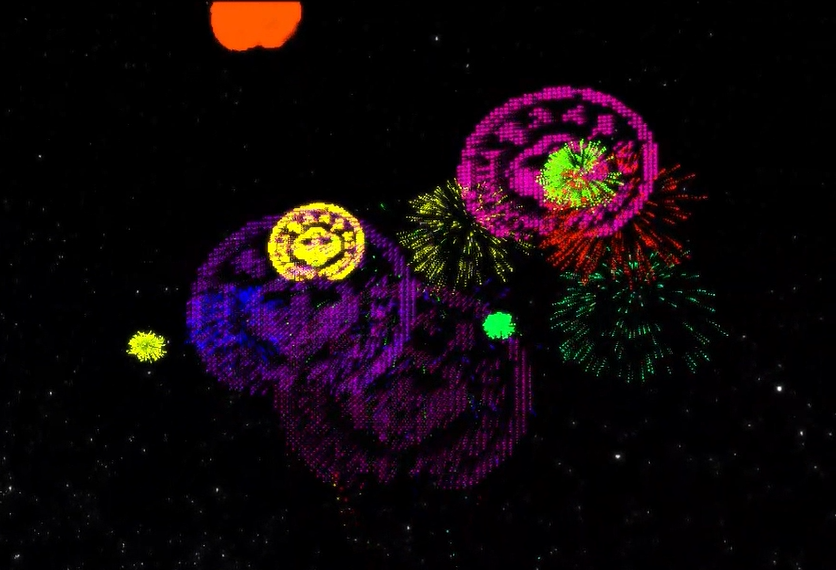

# SYSU计算机图形学大作业 烟花粒子系统项目——GCY班第20小组

## 一、项目介绍

本项目完成了作业要求的所有内容：

+ 构建烟花粒子模型：不要求你使用GPU加速，你只需在CPU上实现烟花粒子系统即可
+ 添加天空盒：添加一个黑夜的天空盒作为背景
+ 添加一个地面：为了使得场景不那么突兀，你只需添加一个平面作为地面
+ 实现烟花光照：为了实现烟花爆炸瞬间的光辉璀璨，你需要在每朵烟花的爆炸中心激活一个点光源，将该点光源的颜色选定为烟花的颜色，爆炸结束后再删除这个点光源。地面需要实现光照（传统Blinn-Phong光照即可），从而凸显烟火闪烁的效果
+ 实现辉光特效：使用高斯模糊之类的后处理技术实现烟花周围的光晕特效，可参考这个
+ 添加音效：在烟花爆炸的时候添加一个Boom的音效

除此之外，我们还额外完成了内容：校徽图案的烟花。

展示视频网址：

展示视频看起来稍微有一点模糊，不是画质的原因，是因为使用了高斯模糊进行处理。

## 二、所需配置

### 1.OpenGL

OpenGL相关库，例如GLFW等都已放置在项目的`Linking`文件夹下。只需要设置包含目录等内容即可。

其中，`glad.c`可能会出现报错的情况。如有发生，请将其从项目中排除，之后重新添加到项目中。

### 2.IrrKlang

本项目需要额外配置IrrKlang音频库。

* [下载链接](https://www.ambiera.com/irrklang/downloads.html)
* [配置教程](https://blog.csdn.net/weixin_46525412/article/details/120639492)

### 三、参考项目

本项目参考了【【OpenGL】多光源+多材质+天空盒场景渲染-计算机图形学(CG)】 https://www.bilibili.com/video/BV1iG411S7TG/
